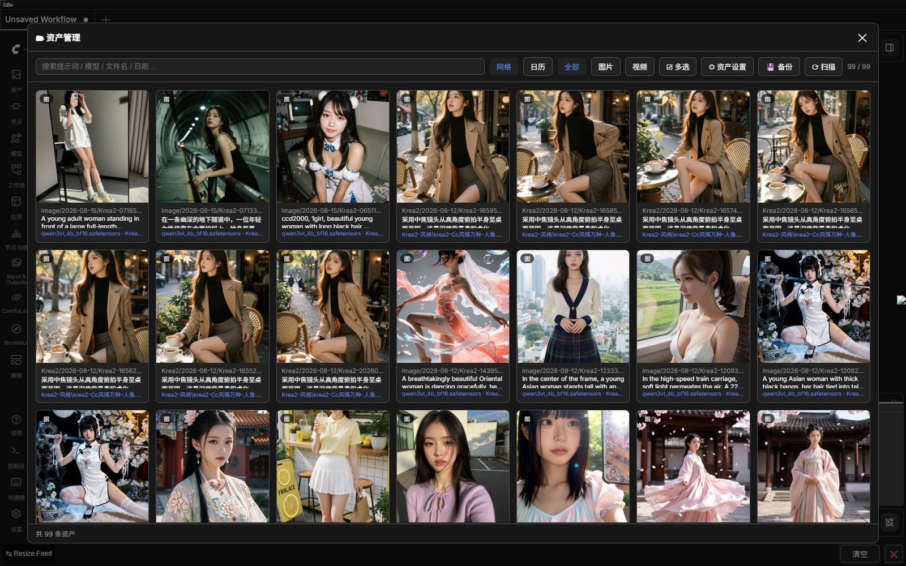
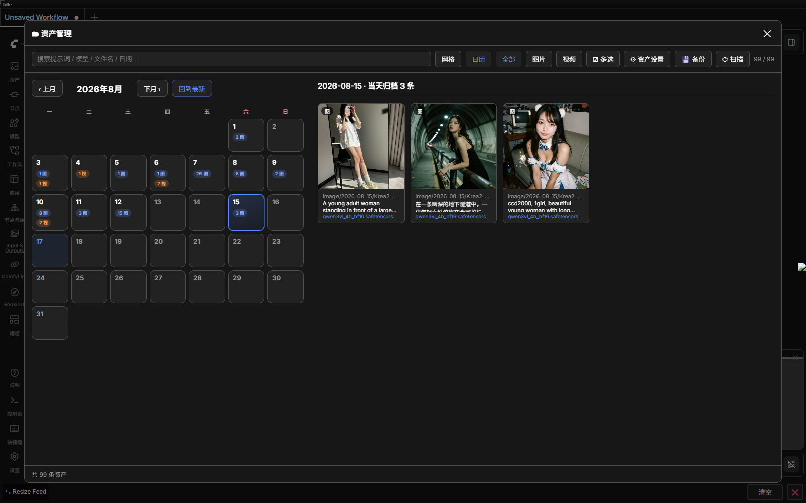
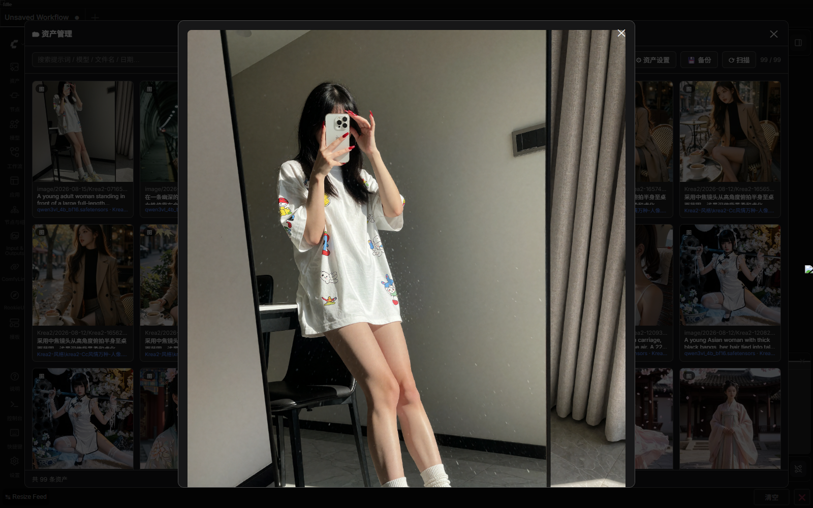
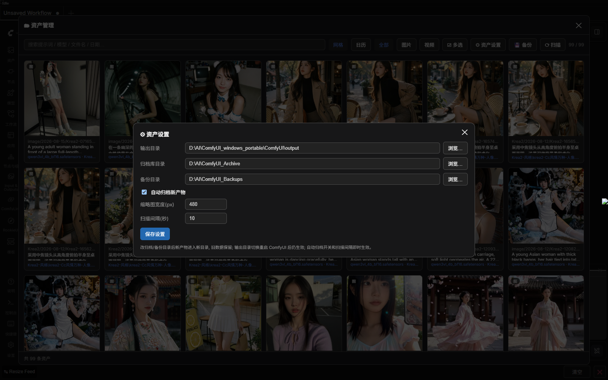
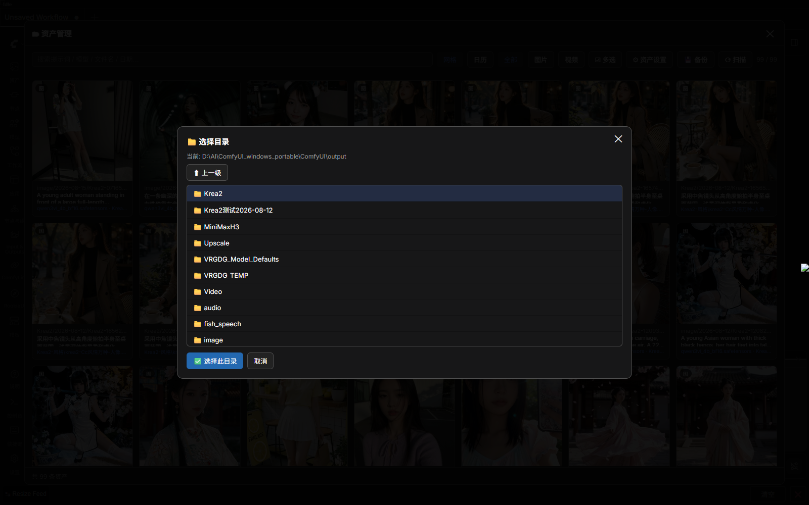

# ComfyUI-AssetManager（ComfyUI 资产管理插件）

集成进 ComfyUI 网页的**资产管理面板**，自动归档你跑出的每一张图/视频，随取随用、可搜索、可批量删除、可一键备份。

## ✨ 功能亮点

- **自动归档**：后台线程自动监视输出目录，新产物即时入库，并提取**提示词 / 正负词 / 参数(seed/steps/采样器…) / 模型与 LoRA / 完整工作流**元数据（读 PNG/WebP 内嵌元数据、MP4/WebM 的 ffmpeg 元数据）。
- **双视图浏览**：网格视图 + **日历视图**（按日期归档，每天显示图/视频数量徽标，点某天看当天产物）。
- **搜索与过滤**：按提示词/模型/文件名/日期全文搜索，按图片/视频过滤。
- **预览与复现**：点开看大图/播视频、复制提示词、下载 workflow.json（拖回画布还原整套工作流）。
- **批量删除**：多选勾选后一键从硬盘删除（归档副本 + output 原始文件），单个删除也可。
- **实时刷新**：面板每 8 秒自动同步，手动复制进输出目录的文件也会被归档、手动删除也会自动消失。
- **输出目录切换**：设置里改输出目录，新产物即时改存；**重启 ComfyUI 后自动恢复**。
- **目录点选**：输出/归档/备份三个目录都带「浏览…」按钮，鼠标点选目录，无需手输路径。
- **一键备份**：把「资产库 + 工作流 + 插件配置」打包成 zip。

### 差异化

- 日历按日期归档浏览（多数同类插件只有网格列表）
- 批量删除 + 实时扫描刷新（手动拖入/删除文件也会同步）
- 输出目录切换且重启自动恢复
- 目录浏览器点选，不依赖手输绝对路径

## 📸 界面预览

| 网格视图 | 日历视图 |
|---|---|
|  |  |

| 预览详情 | 资产设置 | 目录点选 |
|---|---|---|
|  |  |  |

## 📦 安装

### 方法一：ComfyUI-Manager（推荐）

在 Manager 里搜索 `AssetManager` 安装。

### 方法二：git clone

```bash
cd ComfyUI/custom_nodes
git clone https://github.com/Wumihaze/ComfyUI-AssetManager.git
```

### 方法三：手动下载

下载本仓库 zip，解压到 `ComfyUI/custom_nodes/` 下，目录名保持 `ComfyUI-AssetManager`。

> 依赖：Python ≥ 3.9，`Pillow`（ComfyUI 已自带）。视频元数据提取与缩略图需要 `ffmpeg`/`ffprobe`（ComfyUI 便携版自带；也可在系统 PATH 里，或在 `config.json` 里指定路径）。

## 🚀 使用

1. 启动 ComfyUI，顶部菜单栏点「**资产管理**」打开面板。
2. 顶部工具栏：搜索框、网格/日历切换、全部/图片/视频过滤、多选、备份、扫描、资产设置。
3. 点产物 → 预览弹窗：复制提示词 / 下载 workflow.json（拖回画布复现）/ 从硬盘删除。

## ⚙️ 配置

首次运行自动生成 `config.json`（模板见 [`config.example.json`](config.example.json)）。所有配置也可在面板「⚙ 资产设置」里直接改：

| 键 | 说明 |
|---|---|
| `output_dir` | 自定义输出目录（空 = 用 ComfyUI 默认 output） |
| `archive_dir` | 资产归档库目录（空 = `<ComfyUI>/asset_archive`） |
| `backup_dir` | 备份 zip 存放目录（空 = `<ComfyUI>/asset_backups`） |
| `auto_archive` | 是否自动归档新产物（true/false） |
| `thumb_width` | 缩略图宽度(px) |
| `interval_sec` | 归档扫描间隔(秒) |
| `ffprobe` / `ffmpeg` | ffmpeg 工具路径（空 = 自动从 PATH 探测） |

## 📁 归档目录结构

```
<归档目录>/
└─ 2026-08-12/
   └─ 110358_ComfyUI_00016/
      ├─ ComfyUI_00016_.png       # 原产物
      ├─ info.json                # 完整信息(提示词/参数/模型/工作流)
      ├─ prompt.txt               # 人类可读提示词
      ├─ workflow.json            # 拖回 ComfyUI 复跑
      └─ thumb.jpg                # 缩略图(视频取首帧)
```

## 📝 说明

- 归档是**复制**，不影响 ComfyUI 预览；删除时才真正动硬盘。
- 归档目录可随时迁移，只要在设置里改 `archive_dir` 即可（旧数据保留在原目录）。

## 📄 License

[MIT](LICENSE) © 2026 lmtree
